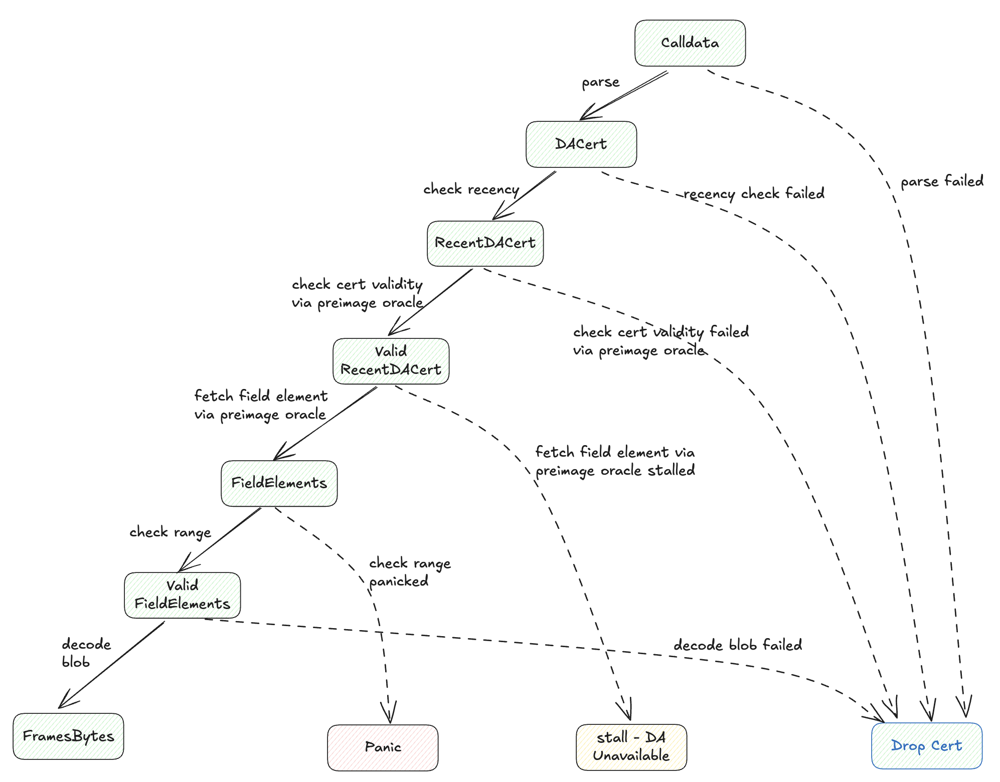

# EigenDA blob derivation for OP stack

> Hokulea is a Polynesian double-hulled voyaging canoe. Hōkūle‘a (“Star of Gladness”), a zenith star of Hawai‘i, which appeared to him growing ever brighter in a dream. [Cite](https://worldwidevoyage.hokulea.com/vessels/hokulea/)

The derivation pipeline in OP consists of stages that brings L1 transaction down to Payload Attributes which are L2 block 
without output properties like Merkle Patricia Tree Root.

The Kona derive derivaiton pipeline post-Holocene contains the following stages
- AttributesQueue
    - BatchProvider
        - Batch Stream
            - Channel Reader
                - ChannlerProvider
                    - FrameQueue                                                
                        - L1Retrieval (EigenDABlobProvider as one of data availability provider)
                            - L1Traversal

The driver of the derivation pipelines calls from the top, and stage owns the stages below. The L1Traversal stage iterates
over the l1 BlockInfo, then returned it to L1Retieval stage. `BlockInfo` mostly contains metadata like `block_hash`, `block_number`, 
`parent_block_hash` and `timestamp`
In the default Kona, based on the `BlockInfo`, L1Retieval can either retrieves data from eth calldata or Ethereum blob.

The hokulea repo defines traits, implementation and supporting crates to include `EigenDABlobProvider` along with two other
data sources to provide secure integration in the kona framework.

At the high level, EigenDABlobProvider implements `DataAvailabilityProvider`, that takes `BlockInfo` and `batcher_address` and returns opaque
bytes that is passed into FrameQueue to derive channel frames. 

Under the hood, Hokulea implements the `DataAvailabilityProvider` by stacking `EthereumDataSource` which implementand `DataAvailabilityProvider`
on top of `EigenDABlobSource` which implements the `EigenDABlobProvider`, capable of retrieving blobs from EigenDA.

- BlockInfo
    - EthereumDataSource
        - EigenDABlobProvider

On the batcher side, channel frames are converted into EigenDA blob, whose DA certificate is sent over to L1.
On the op-node side where the houklea derivation pipeline is run, the `block_info` is first passed to `EthereumDataSource` to retrieve the
DA certificate.
Then DA certificate is passed to `EigenDABlobProvider` into bytes representing `channel frames`.

## Deriving OP channel frames from DA cert

Here is the high level diagram that illustrates the data transformation from calldata downloaded from Ethereum to bytes of decoded OP channel frames.

There are four end state for a byte array corresponding to a DA cert
- dropped
- stall
- panic
- desired output bytes

If a condition (arrow) is suffixed with `failed`, it indicates that the sender of the data (from op-batcher) failed to hold criteria protected by the Hokulea derivation
pipeline when bytes of DA cert arrived on L1, and therefore the corresponding cert is safe to drop.

If a condition is suffixed with stall, it means the data is unavailable by the host process connected by the hokulea client which runs the derivation pipeline

If a condition is marked as panic, it means the host that supplies the field element violates the clear EigenDA protocol property, i.e. every 32 bytes is a proper
bn254 field element.

If nothing went wrong, the hokulea derivation pipeline returns the desired output.

